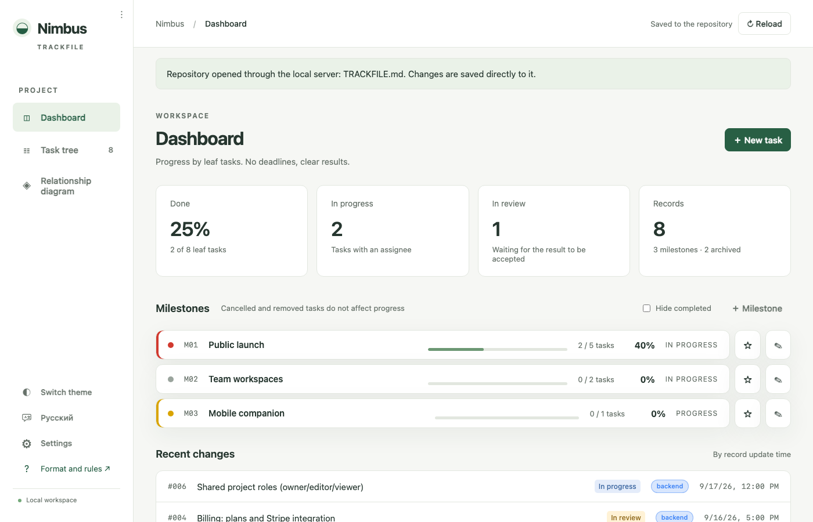
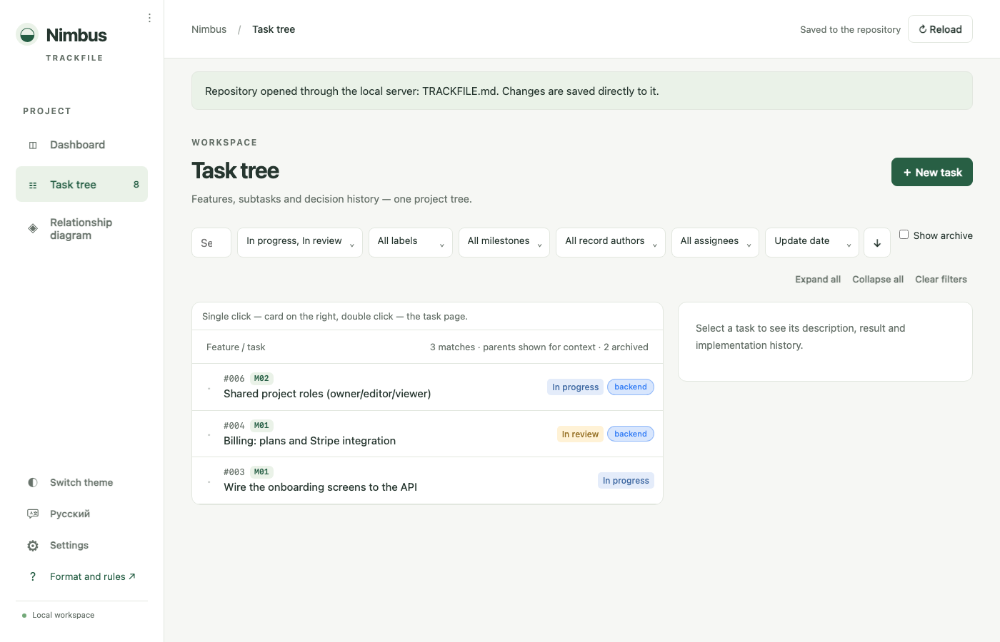
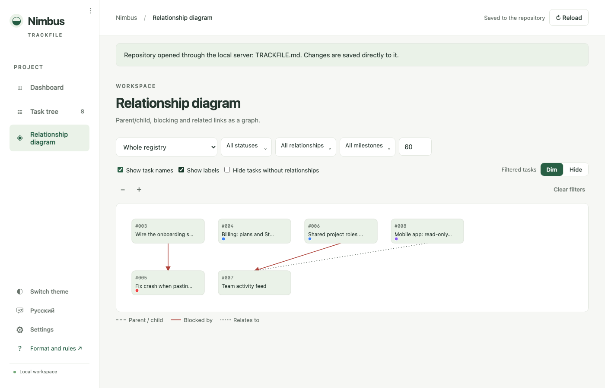

# Trackfile: full reference

**Git-native task tracker for humans and coding agents.**
Tasks live in Markdown next to your code; every edit is a commit.

```sh
npx trackfile init --agents claude,codex   # TRACKFILE.md, .trackfile/, rules for your agents
npx trackfile --open                       # dashboard on http://127.0.0.1:3737/
```

- **Tasks in your repository.** Milestones, features, tasks, subtasks, comments and attachments are plain
  files versioned by Git: `TRACKFILE.md` at the root and a `.trackfile/` folder. Diffs are readable, history
  is `git log`, conflicts are resolved like code.
- **One source of truth for people and AI agents.** A single registry (Markdown with YAML front matter) plus a
  short protocol for coding agents — Claude Code, Codex, Cursor, Gemini CLI and any tool that reads
  `AGENTS.md`: no change without a task number, compare-and-swap ID allocation, task ↔ document back-links,
  `#NNN` in every commit subject. `trackfile init` installs the protocol where each agent looks for it.
- **A dashboard with no build step.** Static HTML and a dependency-free Node server bound to `127.0.0.1`:
  dashboard, task tree, milestone pages, Markdown editor with preview, a source reader with task-mention and
  uncommitted-change highlighting, commit pages with diffs, attachments. English and Russian UI.
- **Every action is a commit.** Creating a task, commenting, editing, archiving, attaching a file — each
  becomes a focused commit like `#042 [new task]: …` touching only the files it changed.
- **Nothing leaves your machine.** No cloud, no database, no telemetry, no network requests beyond the local
  server. The tracker's code is never copied into your repository — only the data files are.

Requirements: Node.js ≥ 18, Git. Chrome/Edge/Safari/Firefox for the dashboard.



## Getting started

```sh
cd your-repository
npx trackfile init --agents claude,codex,cursor
git add TRACKFILE.md .trackfile .gitignore AGENTS.md CLAUDE.md .claude .cursor
git commit -m "#000: add Trackfile"
npx trackfile --open
```

`init` never overwrites anything: an existing registry, agent rule file, block or launch entry is reported
and skipped. Run it again after upgrading the package with `--force` to refresh the agent rules; `--dry-run`
prints the plan without writing. Options:

| Option | Meaning |
| --- | --- |
| `--name NAME` | Project name in the front matter (default: folder name) |
| `--agents LIST` | `claude`, `codex`, `cursor`, `gemini`, `zed`, `opencode`, `jules` or `all` (comma-separated; asked interactively when omitted) |
| `--global` | Also install the rules at user level where the agent reads them (`~/.claude/skills/trackfile/`, `~/.codex/AGENTS.md`, `~/.gemini/GEMINI.md`) |
| `--force` | Update already installed agent rules to this version |
| `--dry-run` | Print what would be created, write nothing |
| `--launch` | Add the dashboard to `.claude/launch.json` (done automatically for `claude`) |

Where the rules land:

| Agent | Project file | Format |
| --- | --- | --- |
| Claude Code | `.claude/skills/trackfile/SKILL.md` + a short pointer block in `CLAUDE.md` | skill (`name: trackfile`) |
| Codex, Zed, OpenCode, Jules | `AGENTS.md` | marked block `<!-- trackfile:start … -->` with the full protocol |
| Cursor | `.cursor/rules/trackfile.mdc` | rule with `alwaysApply: true` |
| Gemini CLI | `GEMINI.md` | marked block |

The protocol text itself is [`skill/PROTOCOL.md`](../skill/PROTOCOL.md): read it once to know what your agents
are held to. It is the single source for every installed variant.

## Commands

```
trackfile [serve] [--open] [--port N] [--registry FILE]   start the dashboard (default command)
trackfile init [--name NAME] [--agents LIST] [--global] [--force] [--dry-run] [--launch]
trackfile toc [--closed] [--all] [--registry FILE]         table of contents for agents
trackfile check [--registry FILE]                          validate registry/archive invariants
```

The commands below only apply once a project has moved its data to a [shared branch](#shared-data-branch-multi-agent-multi-clone):

```
trackfile migrate --shared [--branch NAME] [--remote NAME] [--local] [--push] [--dry-run]
trackfile migrate --rollback [--dry-run]
trackfile new TITLE [--parent ID] [--milestone ID] [--body TEXT] [--marker NAME]
trackfile take ID [--marker NAME]
trackfile set ID FIELD VALUE [--marker NAME] [--acknowledge]
trackfile comment ID TEXT [--marker NAME] [--acknowledge]
trackfile sync [--marker NAME]
trackfile status [--marker NAME]
```

`serve` and `toc` look for `TRACKFILE.md` upwards from the current directory (like Git looks for `.git`), so
they work from any subfolder. `--registry` names a differently placed registry (for example
`--registry docs/PROJECT.md`). The port defaults to 3737 (`PORT` or `--port`); `--open` launches the browser.
Only one dashboard per repository is needed — it re-reads the files every 2.5 s while the tab is visible.

In Claude Code the dashboard is described in `.claude/launch.json` (entry `trackfile`) and opens in the
built-in browser panel.

## Files in your repository

```
TRACKFILE.md               # the registry: milestones, next_task, open and recently closed tasks — committed
.trackfile/
  archive.md               # closed tasks older than a week, same format — committed
  tasks/042/comments.md    # comments of task 042 — committed
  tasks/042/logo.png       # attachments of task 042 — committed
  config.json              # one person's dashboard state (filters, theme, language) — git-ignored
```

The paths are parameters with these defaults. A project may override the three secondary paths in the
registry's front matter (`archive_file`, `tasks_dir`, `config_file`, relative to the repository root) and the
registry itself with `--registry`; relative links in task text are resolved relative to the registry file.

## Shared data branch (multi-agent, multi-clone)

By default the registry lives in your working branch, next to the code — fine for one clone at a time. Once
several agents and machines are pushing tasks concurrently, the working branch stops being a good place for
it: every task, comment and status change would be its own commit competing with real code changes on
whatever branch happens to be checked out. **Shared mode** moves the registry to its own `trackfile` branch
instead, checked out as a [git worktree](https://git-scm.com/docs/git-worktree) at `.trackfile/` — a second,
lightweight working directory backed by the same clone, so nothing about your own branch or working tree
changes.

```
trackfile migrate --shared
```

does the move: it tags the pre-migration commit (`trackfile-pre-migration`) and copies the data files to a
sibling backup folder first, imports them into an orphan commit on the `trackfile` branch, verifies the
import byte-for-byte, pushes it, and only then removes the files from your working branch and sets up the
worktree. `--dry-run` prints the plan without writing anything; `--local` skips the push for a single-clone
setup; `--push` also installs a GitHub Actions workflow that runs `trackfile check` on every push to the
data branch and (via the `gh` CLI, if it's installed and authenticated) turns on branch protection requiring
it. Run `trackfile migrate --rollback` to undo it — the files come back from the data branch, and the
`trackfile` branch and the backup tag are left in place either way, for you to remove once you're sure.

**How a write becomes a commit.** Every agent command (`new`, `take`, `set`, `comment`) and the dashboard's
own writes are one transaction: take a local lock (`.trackfile/.sync.lock`, coordinating every agent and
dashboard instance on the machine), fetch, fast-forward the worktree onto the current tip, apply the change,
commit, and `push --force-with-lease`. A push that loses a race is retried — fetch again, reapply the change
against the new content (so e.g. a task number is reallocated against the actually-current `next_task`,
never a stale one), and push again, a few times with backoff before giving up. `trackfile new` specifically
refuses outright when the remote can't be reached, rather than create a task number only you can see.

**Files you'll see:** `.trackfile.json` at the repository root (the pointer — `{"branch", "remote", "mode":
"shared"}` — commit this) marks a project as migrated; `.trackfile/` is now the worktree checkout of the
`trackfile` branch (git-ignored from your working branch's point of view, since it's not part of it) holding
the same `TRACKFILE.md`/`archive.md`/`tasks/` layout as before, plus `.trackfile/.sync.lock` and
`.trackfile/.agent/<marker>.json` (per-agent local state — both git-ignored, local to the machine).

**If the remote is unreachable**, a write still commits locally and reports how many commits are queued
(`trackfile status`, or the dashboard's sync badge); the *next* transaction by anyone — not necessarily the
same agent or machine — flushes it automatically. `trackfile sync` is the explicit way to send (and pull)
right away: it also handles edits made by hand in the worktree, which a transaction (built around replaying
a well-defined change, not an arbitrary diff) won't touch — a rejected push there falls back to an actual
`git merge`, using the structural merge driver `trackfile migrate` registers on `TRACKFILE.md`/`archive.md`
(record-by-record; a genuinely conflicting field, like two different `status` transitions, is reported
rather than guessed at).

**Without access to the remote**, an agent can still read the registry and edit existing tasks (`set`,
`comment`) — those queue locally like any other write — but `trackfile new` refuses, since there would be no
way to guarantee the allocated number is actually unique once connectivity comes back.

Cross-references from code comments or docs into the registry (`[#NNN](TRACKFILE.md#task-NNN)`, see below)
need a path that still resolves once the registry has moved off the working branch: use
`.trackfile/TRACKFILE.md#task-NNN` for a relative link meant to be read locally (through the dashboard or a
plain file viewer with the worktree present), or `blob/trackfile/TRACKFILE.md#task-NNN` for a link meant to
be read on GitHub's own web UI (which has no worktree — this resolves against the `trackfile` branch's own
blob view). The dashboard's reader recognizes both, alongside the plain legacy path.

## Agents and the registry

Agents do not need the dashboard: they read and edit the files directly by the protocol. The protocol is
short; its core is:

1. **No change without a task.** Before touching any file the agent names the `### TASK NNN` it works on and
   records it in `TRACKFILE.md` (`in_progress`, `assignee`, `branch`, `updated_at`).
2. **Read by the table of contents, not in full:** `npx trackfile toc` prints one line per open task (number,
   status, effective milestone, parent, kind, title, comment count); `--closed` adds closed tasks, `--all` the
   archive. Without Node: `grep -A8 '^### TASK' TRACKFILE.md | grep -E '^(### TASK|title:|status:|parent:|milestone:)'`.
3. **Pick the task in order:** the number the user named → an existing task that matches unambiguously → a new
   task in the fitting milestone → a new milestone. Closed tasks are not candidates.
4. **Allocate numbers as a compare-and-swap** on `next_task`, re-reading the file right before the insert.
5. **Finish in `review`, without a commit.** `done` and the commit come only after the user's explicit
   permission. The commit subject starts with the task numbers (`#134 #135: …`), changed logic carries a
   `// #NNN: why` comment, documentation paragraphs carry `[#NNN](…/TRACKFILE.md#task-NNN)` marks and the
   document path goes into the task's `sources`.
6. **Comments are instructions.** `#### COMMENT N [ ]` blocks in `.trackfile/tasks/NNN/comments.md` are
   mandatory context; a fully handled one becomes `[x]`.

## The dashboard

Pages: dashboard (milestone progress, pinned tasks, recent changes), task tree with search, multi-status and
milestone filters, a **Relationship diagram**, milestone pages (progress, description, the milestone's own
tree), task pages (description, result, sources, dependencies, labels, subtasks, files, comments), a source
reader and commit pages. Every page-level move is a browser history entry with a deep link: `#tree`,
`#diagram`, `#task/042`, `#task/042/comment/3`, `#milestone/M02`, `#source/docs/design.md`, `#commit/<hash>`.



**Dependencies and labels.** A task's context menu offers **Relationships** (a search filter, a Blocked
by/Blocking/Relates to switch, and a checklist of every other task, staged and applied on Save; "Blocked by" —
a Finish-Start blocking link with a warning chip on any task waiting on an open blocker; "Blocking" — its
reverse, picked from the same task; "Relates to" — a non-blocking, non-hierarchical link; a task that would
directly block one already blocking it is disabled in the list, and any longer blocking cycle is rejected on
save) and **Labels**, a searchable checklist of every label (colored chips,
preset palette or a custom color) with an inline "Create label" row. Its "Manage labels" button, also reachable
from the sidebar's **Settings** menu, opens a dialog to edit or delete any label (with a warning naming how
many tasks lose it). `trackfile init` seeds a default set of labels (bug, enhancement, documentation, question,
wontfix); an older registry that predates labels gets the same default set the first time **Labels** or
**Manage labels** is opened on it, so a project never shows an empty list, but nothing changes on disk until
you actually look. A task page lists its Blocked by/Blocking/Related tasks with a trash icon on each entry to
drop that one link without opening the dialog. Dependencies and labels are editable at any status, unlike
title/description/parent. The
**Relationship diagram** page draws
parent/child, blocking and "relates to" links as a small graph (dashed/solid/dotted lines, a legend, click a
node to open it), centered on the whole registry or one task, with a status filter, an edge-type toggle and a
node cap (dim or hide whatever the filters exclude) so a large registry stays readable.



Tasks are created with **New task** / **Subtask** (an existing task can be made a subtask too); title,
description, parent and milestone are editable only while the task is `to-do` with no assignee — everything
else belongs to the agent that took it. Status changes through **Change status** (on the page and in the
context menu opened with the right mouse button on any task element): `done` stamps `completed_at`, leaving
`done` clears it, `in_progress` without an assignee assigns `User`. Milestones are created and edited with
their explicit set of tasks; a subtask without a milestone inherits its parent's.

Description, result, comments and milestone descriptions are Markdown (headings, lists, code, quotes, tables,
links, images) rendered through `textContent` only — HTML stays text. A single line break inside a paragraph
is kept, as in GitHub comments. The text fields have a Markdown helper: ⌘B/⌘I/⌘E wrap the selection, ⌘K makes
a link, Enter continues lists, Tab/⇧Tab indent, a **Preview** tab renders the result. `#NNN.K` in text links
to comment K of task NNN; `[#NNN](TRACKFILE.md#task-NNN)` opens the task page.

**Files.** Any task can hold attachments (`.trackfile/tasks/NNN/`): drag them in from the task page, the card
or the editor. Images are compressed on the client (long side 1600 px, JPEG or PNG when transparent) and
inserted into the description as ``; `#w=` sets the display size and
is ignored by other viewers. Every upload and deletion is its own commit.

**Reader.** Paths from a task's `sources` open in a read-only reader (text files under the repository root,
never dotfiles or `.git`, up to 2 MB) with syntax highlighting and, for Markdown, rendered output whose links
open in the same reader. Opened from a task, the reader highlights every mention of it — back-link marks,
`#NNN` and `TASK NNN` in text and code comments — with "‹ ›" navigation. Uncommitted changes of the file
(`git diff HEAD`, index plus working tree) are shown in place: added lines green on the narrowest block,
deleted lines red where they were.

**Commit pages.** A task's commit hash links to a page with the message (task numbers linked), author, date,
parents, tasks that reference the commit, the file list and a unified diff per file.

**Archive.** On load, closed tasks (`done`/`cancelled`/`removed`) older than a cutoff (seven days by default,
`archive_after_days` under Settings → **Auto-archive**, project-wide via the registry's front matter) move
from `TRACKFILE.md` to `.trackfile/archive.md` in one write and one commit (`#001 #002 [auto archive]: …`); a
feature with open subtasks stays. **Archive** / **Unarchive** move a task by hand in either direction; a
finished task can still have finished subtasks sitting in the registry (the dashboard never archives them on
its own), so a manual archive with such subtasks offers to sweep the whole closed subtree in the same commit.
A task returned by hand is left alone until its status changes; reopening an archived task returns it
automatically. Archived tasks are hidden in the tree until **Show archive** is ticked and never count
differently in progress. Agents never archive: they set `done`, the dashboard moves the record.

**Concurrency.** The dashboard writes each file with a compare-and-swap against the content it last read; an
external change (an agent editing the registry) blocks the save, keeps your draft in the form and asks you to
reload. An externally edited `config.json` is never silently overwritten either. Agents and the dashboard
share no lock: do not edit the same file in the dashboard and in an editor at the same time.

**Language and theme.** English by default, Russian when the browser prefers it; the switch at the bottom of
the sidebar stores an explicit choice in `.trackfile/config.json`, next to the theme. Status values, YAML keys
and file names are never translated. A string missing from the dictionary is shown as its key, never dropped.

## Registry format (schema 1)

`TRACKFILE.md` is Markdown with a YAML front matter and a flat YAML block per record. Only a documented
subset of YAML is accepted: flat `key: value` pairs with keys `[a-z][a-z_]*`; strings in double quotes with
JSON escaping (`"042"` is always a string); `null`, integers, `true`/`false`; arrays as inline JSON
(`["a", "b"]`); bare identifiers such as `to-do`; comments on their own line. Nested objects, anchors, single
quotes, `|`/`>` blocks and inline comments are rejected. Unknown fields are preserved on edit; an unknown
`schema` is refused.

```yaml
---
schema: 1
project: "Sample"
next_task: 43
---
```

`next_task` is a monotonic counter strictly greater than every existing ID; task IDs have at least three
digits, milestone IDs are `M` plus at least two digits; IDs are never reused. An optional `archive_after_days`
(a non-negative integer) overrides the default seven-day auto-archive cutoff for the whole project; the
dashboard writes it from Settings → **Auto-archive**. The file has a `## Milestones`
section and a `## Tasks` section (the section names are free — the parser only uses `## ` headings as
boundaries); each record is an exact heading followed immediately by a `yaml` fence:

````markdown
### MILESTONE M01
```yaml
id: "M01"
title: "First milestone"
priority: "normal"
```

Free-form description of the milestone.

### TASK 042
```yaml
id: "042"
title: "Task title"
kind: "task"
parent: "038"
milestone: null
status: "to-do"
author: "User"
assignee: null
created_at: "2026-01-01T12:00:00+00:00"
updated_at: "2026-01-01T12:00:00+00:00"
completed_at: null
branch: null
commit: null
result: ""
sources: ["docs/design.md"]
blocked_by: ["038"]
relates_to: ["051"]
labels: ["L01"]
```

Description in Markdown. `#`, `##`, `###` are reserved for the structure — use `####` or plain text.
````

| Field | Meaning |
| --- | --- |
| `kind` | `feature` — a lasting capability or group; `task` — concrete work |
| `parent` | ID of the parent or `null`; cycles and missing parents are rejected |
| `milestone` | ID or `null`; `null` inherits the nearest explicitly set ancestor milestone |
| `status` | `to-do`, `in_progress`, `review`, `done`, `cancelled`, `removed`. Agents finish in `review`; `done` and the commit follow the user's acceptance |
| `author` | Who created the record: `User`, `Claude`, `Codex`, … The dashboard writes `User` |
| `assignee` | Who took the work; `in_progress` requires one |
| `created_at`, `updated_at` | ISO 8601 with a timezone offset; `updated_at` drives "newest first" sorting |
| `completed_at` | When the task became `done`; `null` otherwise |
| `branch`, `commit` | The real branch and an existing implementation commit, or `null` |
| `result` | What was done, how it was verified, what remains |
| `sources` | Repository-relative paths to documents and code backing the status; Markdown documents in this list carry back-link marks |
| `blocked_by` | Optional array of task IDs that must finish before this one (a Finish-Start blocking dependency); a blocking cycle is a format error. The reverse "blocks" view and the "relates to" view are derived, never stored twice |
| `relates_to` | Optional array of task IDs for a non-blocking, non-hierarchical link; recorded on either side, shown on both |
| `labels` | Optional array of `Lxx` label IDs (see `LABEL` records below) |
| `priority` (milestones) | `low` / `normal` / `high`; absent means `normal` |

Progress = `done / leaf active tasks`: a leaf is a record without children; `cancelled`/`removed` records and
all their descendants are excluded; `review` is not `done`; archived tasks count like active ones.

**Labels** are records in an optional `## Labels` section, next to `## Milestones`:

````markdown
### LABEL L01
```yaml
id: "L01"
title: "Bug"
color: "#ef4444"
```
````

`id` is `L` plus at least two digits, `color` a `"#rrggbb"` hex string (the dashboard offers a preset palette
and a color picker); a task references labels by ID in its `labels` array. Labels live only in the registry,
never in the archive. A brand-new registry (`trackfile init`) gets the same default set — bug, enhancement,
documentation, question, wontfix — that an older registry with no `## Labels` section gets seeded with the
first time the dashboard's Labels or Manage labels dialog is opened on it (an empty `## Labels` section is
left alone: the project already opted out of the defaults).

**Comments** live in `.trackfile/tasks/NNN/comments.md`, never in the registry (a `#### COMMENT` inside a
record is a format error). The file holds only numbered blocks; numbers grow from 1 and are never reused, so
`#42.3` always means the same comment. `[ ]` is open, `[x]` handled.

````markdown
#### COMMENT 1 [ ]
```yaml
id: 1
author: "User"
updated_at: "2026-01-02T12:00:00+00:00"
```

Please also cover the empty state.
````

**Archive** (`.trackfile/archive.md`) has the same record format with front matter `schema: 1`, `project`,
`archive: true`, no milestones and no `next_task`; every archived record carries `archived_at`, which is
forbidden in the registry. Both files parse into one tree: a parent may live in the other file, IDs are
unique across both.

## Local server API

All routes are bound to `127.0.0.1` and read/write only the files above.

| Route | Purpose |
| --- | --- |
| `GET /api/registry` | The whole registry in one response: `layout` and `files` (`registry`, `archive`, `comments/NNN`) |
| `GET/PUT /api/file/<name>` | One file by logical name (`registry`, `archive`, `config`, `comments/NNN`); `PUT {text, expected}` writes only when `expected` matches the current content (409 otherwise); `text: null` deletes |
| `POST /api/git/commit` | `{operation, taskId(s), title, files}` → one commit of exactly those registry files with subject `#NNN [operation]: title` |
| `GET /api/source/<path>` | Read-only text file under the repository root with its uncommitted `-U0` patch |
| `GET /api/commit/<hash>` | Commit metadata, numstat and patch (4 MB cap) |
| `GET/PUT/DELETE /api/files/<NNN>[/<name>]` | List, upload (raw body) and delete attachments; `GET /attachments/<NNN>/<name>` serves them |

Errors are JSON `{error, code, params}`; the dashboard translates known codes.

## Development

```sh
npm test                       # node --test tests/*.test.cjs — model, server, CLI, i18n, renderer, helpers
npm run test:browser           # Playwright + Chrome: NODE_PATH to a folder with playwright, CHROME_PATH optional
```

Unit tests run on synthetic registries in temporary folders; the browser test starts the server on a
throwaway Git repository and drives the dashboard end to end (creating, editing, commenting, committing,
switching language, mobile layout). Nothing reads or writes a real project.

The code is plain scripts without a bundler: `app/` is the UI (served as is), `lib/` the server, layout
discovery, `init` and `toc`, `bin/trackfile.js` the CLI, `skill/PROTOCOL.md` the agent protocol,
`templates/` the files `init` creates.

## License

MIT
